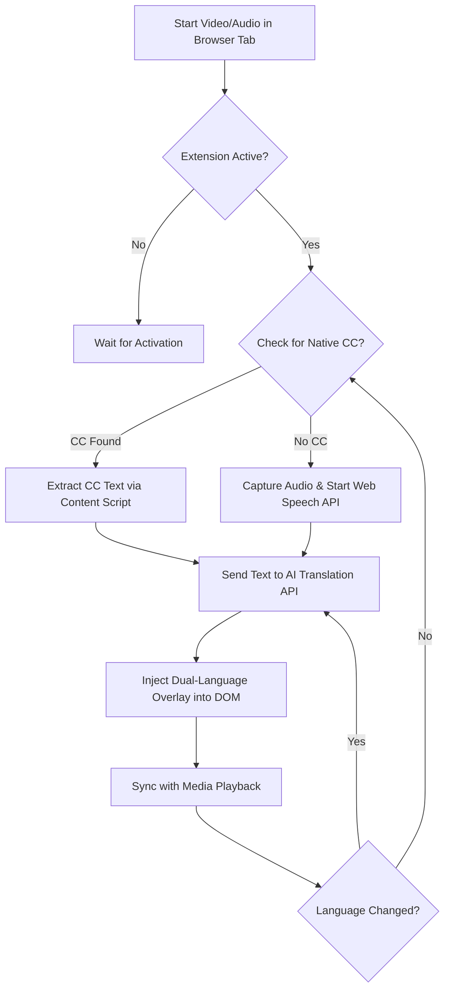

# Product Requirements Document (PRD): Jayden Multilingual Translator

## 1. EXECUTIVE SUMMARY
**Jayden Multilingual Translator** is a professional-grade Chrome Extension designed to break language barriers in digital media. It provides real-time, AI-driven speech-to-text and translation for any web-based audio or video content.

### 1.1 Problem Statement
Users consuming international content (educational, entertainment, or professional) often face:
*   Lack of native subtitles.
*   Inaccurate auto-captions.
*   Inability to understand technical jargon in foreign languages.

### 1.2 Business Goals & KPIs
*   **Goal**: Seamless understanding of any audio/video stream on the web.
*   **KPIs**:
    *   **Latency**: < 0.5s delay from audio capture to translation display (Real-time).
    *   **Accuracy**: > 95% Accuracy (WER < 5%) for major languages.
    *   **Retention**: Weekly active users (WAU) growth.

---

## 2. PERSONAS & PERMISSIONS
| Persona | Goals | Pain Points |
| :--- | :--- | :--- |
| **Language Learner** | Improve listening skills, see dual captions. | Fast speech, missing vocab. |
| **Global Researcher** | Access niche technical webinars/videos. | Heavy accents, no CC available. |
| **Accessibility User** | Understand audio without sound. | Visual overlay cluttering controls. |

---

## 3. SCOPE & FEATURES

### 3.1 Use Case Diagram
```mermaid
usecaseDiagram
    actor "Web User" as User
    actor "System" as Sys
    actor "Translation API" as Trans

    package "Jayden Extension" {
        usecase "Capture Web Audio" as UC1
        usecase "Process Speech-to-Text" as UC2
        usecase "Translate Text" as UC3
        usecase "Render Subtitles" as UC4
        usecase "Customize UI Settings" as UC5
        usecase "Select Target Language" as UC6
    }

    User --> UC1
    User --> UC5
    User --> UC6
    UC1 --> UC2
    UC2 --> UC3
    UC3 --> UC4
    UC3 -- Trans
```

### 3.2 Feature Decomposition
1.  **Data Source Orchestrator**: Logic to toggle between CC extraction and Audio capture.
2.  **CC Extractor**: Specialized scraping for YouTube/Netflix/Generic CC tracks.
3.  **Native Transcription (Web Speech API)**: Browser-level STT for videos without captions.
4.  **AI Translation Engine**: GPT-4o-mini for high-context, fast translation.
5.  **Overlay UI**: Resizable, draggable dual-language subtitle container.

---

### 4. PROCESS FLOW (BPMN Style)


---

## 5. USER STORIES

### US-001 – Audio Stream Capture
**Priority**: High | **Story Points**: 5 | **Status**: Refined

**As a** Global Media Consumer
**I want to** permit the extension to capture the current tab's audio
**So that** the system can process the sound for transcription.

**Context**: Necessary for sites without native subtitle tracks (e.g., live streams, podcasts).

**Acceptance Criteria (Gherkin)**:
*   **Scenario 1 – Successful Capture (Happy Path)**
    *   **Given** I am on a page with an active `<video>` element
    *   **When** I click the "Start Capture" button in the popup
    *   **Then** the browser should prompt for tab-capture permission
    *   **And** the system starts streaming audio blocks to the background script.
*   **Scenario 2 – Audio Source Missing (Error Case)**
    *   **Given** I am on a page with no media elements
    *   **When** I attempt to start capture
    *   **Then** the system should display a validation error: "No audio source detected on this page."

---

### US-002 – Real-time Dual-Language Subtitle Rendering
**Priority**: High | **Story Points**: 8 | **Status**: Refined

**As a** video viewer
**I want to** see dual-language subtitles (with the original language converted from sound displayed above the translated language)
**So that** I can understand the content in both languages simultaneously with the text overlaid on top of the video.

**Acceptance Criteria (Gherkin)**:
*   **Scenario 1 – Dual Subtitle Rendering (Happy Path)**
    *   **Given** the transcription and translation engines have generated text blocks
    *   **When** the UI renders the overlay
    *   **Then** the original text should appear on the top line
    *   **And** the translated text should appear directly below it
    *   **And** both lines should be clearly visible within the same draggable container.
*   **Scenario 2 – Draggable Overlay**
    *   **Given** subtitles are visible
    *   **When** I mouse-down on the subtitle box and drag
    *   **Then** the box position should update accordingly across screen coordinates.

---

### US-003 – Target Language Selection
**Priority**: High | **Story Points**: 3 | **Status**: Refined

**As a** video viewer
**I want to** select my preferred target language from a drop-down menu in the extension popup
**So that** I can understand the content in the language I am most comfortable with.

**Acceptance Criteria (Gherkin)**:
*   **Scenario 1 – Changing Target Language**
    *   **Given** the extension is active and translating to "English"
    *   **When** I open the popup and select "Vietnamese" from the language list
    *   **Then** the system should update the internal state to the new language
    *   **And** the next subtitle block should be translated into Vietnamese.
*   **Scenario 2 – Persisting Language Choice**
    *   **Given** I have selected a target language
    *   **When** I close and reopen the browser
    *   **Then** the extension should remember and use my last selected language.

---

## 6. NON-FUNCTIONAL REQUIREMENTS (NFRs)
1.  **Performance**: Max 1500ms latency from audio emission to translation display.
2.  **Security**: All API keys must be encrypted in `chrome.storage.local`.
3.  **Scalability**: Supports concurrent transcription for multiple tabs (if resources allow).
4.  **Accessibility**: WCAG 2.1 compliance for subtitle contrast and font scaling.
5.  **Privacy**: No audio data should be stored on the server permanently.

---

## 7. ASSUMPTIONS & RISKS
| ID | Category | Description | Mitigation |
| :--- | :--- | :--- | :--- |
| **A-01** | Technical | Users have a stable internet connection for Cloud APIs. | Implement caching & retry logic. |
| **R-01** | Legal | Copyright issues with capturing protected streams (DRM). | Detect DRM and notify user of limitations. |
| **R-02** | UX | Overlay blocking native site controls. | Provide Opacity and Position controls. |

---

## 8. DEFINITION OF DONE (DoD)
*   [ ] Functional code verified against AC (Gherkin).
*   [ ] Unit tests pass (> 80% coverage).
*   [ ] UI/UX reviewed against the design system.
*   [ ] Privacy policy and permissions updated.
*   [ ] Documentation (README/API) updated.
